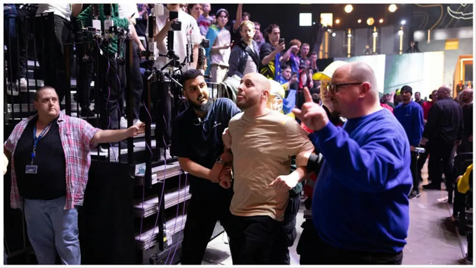
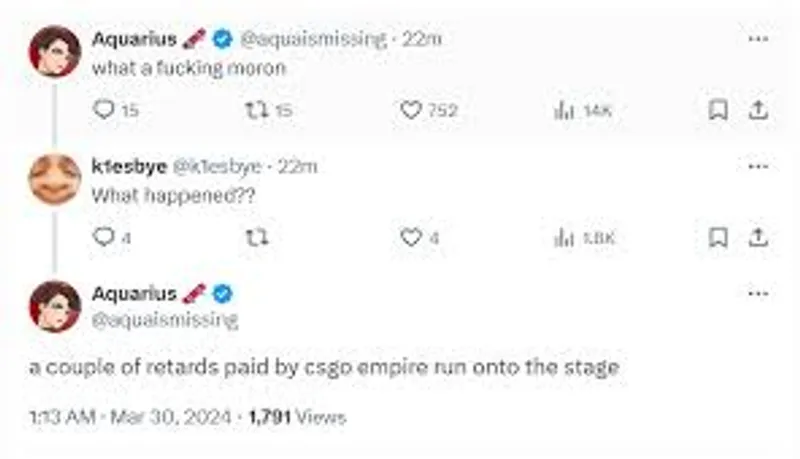

+++
title = 'CS GO News: Inside the G2 vs Mouz Match Stage Invasion'
date = 2026-06-03T10:00:00+05:00
draft = false
image = '96178ab2-4b06-400f-bb8d-9d100987febf.webp'
summary = 'In the realm of CS GO news, an unexpected event unfolded during the G2 vs MOUZ match at the CS GO Major in Copenhagen, sparking widespread attention in the esports community.'
tags = ['esports', 'G2 vs Mouz', 'Gaming news', 'Stage Invasion']
+++

In the realm of CS GO news https://www.heet.gg/, an unexpected event unfolded during the G2 vs MOUZ match at the CS GO Major in Copenhagen, sparking widespread attention in the esports community. The incident, occurring on March 29, 2024, saw unknown individuals attempt to storm the stage, a protest linked to G2's partnership with online casino CSGORoll, highlighting the intense moments that can arise in Counter Strike Global Offensive events.

This breach not only disrupted the game but also ignited a series of discussions within the Counter Strike, HLTV org, and broader esports world, showcasing the unexpected intersections between esports and real-world issues. As the story unfolds, this article will delve into the precipitating factors, the moment of chaos itself, and the aftermath of one of the most talked-about incidents in recent Counter Strike Global Offensive news.

## The Precipitating Factors

The precipitating factors behind the G2 vs Mouz match stage invasion are deeply rooted in G2's controversial partnership with CSGORoll, an online casino accused of fraudulent activities and scamming users. This partnership has sparked widespread criticism and concern within the esports community for several reasons:

- **Verified Criminal Activities**: CSGORoll is identified as a "verified criminal organization" involved in scamming its users, with G2 receiving millions for advertising the illegal casino.
- **Underage Engagement**: The partnership raised eyebrows for promoting gambling to a young audience, notably using a minor, the Russian AWPer who had just turned 18, to reach out to potential users.
- **Organized Protest**: The stage invasion was not spontaneous but seemingly organized by CSGOEmpire, a rival gambling site. Its owner, 'Monarch', was reported to offer financial incentives to those willing to disrupt the match, aiming to draw negative attention to CSGORoll. Flyers were distributed at the event, calling for a boycott of G2 and the resignation of its CEO, Alban Dechelotte, due to the partnership.

These factors collectively contributed to the tension and eventual protest at the Royal Arena in Copenhagen, reflecting the community's growing concerns over unethical partnerships within esports.

## Moment of Chaos



As the match commenced, all eyes were fixated on the screen, the crowd's energy palpable in the Royal Arena. It was during the second half, just as MOUZ was closing the gap on a G2 lead, that the unexpected occurred. A group of individuals bearing signs and wearing t-shirts emblazoned with anti-CSGORoll slogans breached security and stormed the stage. The casters' voices turned from calm narration to confusion as the match was abruptly halted.

## Security's Swift Response

The quick response from event security prevented what could have escalated into a larger disturbance. The intruders were swiftly escorted off the premises, and order was restored within minutes. However, the ripple effect of their message was already reverberating through the venue and across countless live streams.

## The Match Resumes

After a brief pause to ensure the safety of players and attendees, the officials decided to resume the match. Both teams, showing remarkable professionalism, refocused on the game at hand. G2, perhaps spurred by the interruption, regained their composure quicker and capitalized on the shaken state of MOUZ to secure a series of rounds that would lead them to a hard-fought victory.

## The Aftermath

The event's aftermath saw a flurry of activity on social media. The esports community was ablaze with debates on the implications of the protest. Some defended the act as a necessary statement against the normalization of gambling in esports, while others condemned the disruption of the event as an unsafe and unproductive method of protest.

## Statements from Involved Parties

G2 Esports released a statement emphasizing their commitment to their fans and the integrity of esports, noting that they would review their partnerships in light of the recent events. CSGORoll has yet to comment on the incident. Meanwhile, HLTV.org has begun an investigation into the motives behind the organized protest, with 'Monarch's' actions coming under particular scrutiny for potentially inciting the event.

## Looking Forward

The stage invasion has sparked a necessary dialogue within the esports community about the role and impact of sponsorships, the influence of betting sites, and the responsibilities of teams to their fanbase, especially younger audiences. The discussions following the G2 vs MOUZ match are set to shape future sponsorship strategies and perhaps redefine the ethical boundaries within the competitive world of esports.
