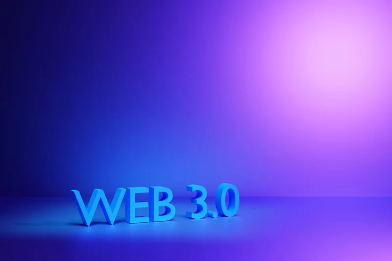
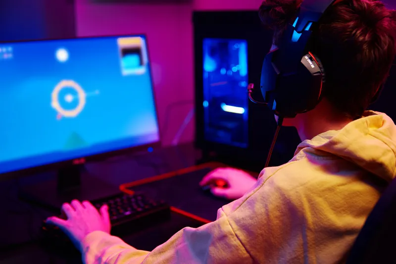

+++
title = 'The Future of Gaming: Everything You Need to Know About Web3 Gaming'
date = 2026-06-02T10:00:00+05:00
draft = false
image = 'hero.webp'
summary = 'As an avid gamer and technology enthusiast, I have witnessed firsthand the remarkable evolution of the gaming industry. From pixelated screens to immersive 3D environments, the transformation has been nothing short of a digital renaissance.'
tags = ['esports']
+++

As an avid gamer and technology enthusiast, I've witnessed firsthand the remarkable evolution of the gaming industry. From pixelated screens to immersive 3D environments, the transformation has been nothing short of a digital renaissance. Today, we stand on the cusp of another monumental shift – the advent of web3 gaming. In this in-depth exploration, I'll guide you through the intricate web of web3 gaming, a realm that's poised to redefine our gaming experiences and expectations.

## Introduction to web3 gaming

The term "web3 gaming" might sound like a futuristic buzzword, but it embodies a significant leap in how we perceive and interact with games. At its core, web3 gaming represents the synergy between gaming and the decentralized web – often referred to as Web3. This involves the integration of blockchain technology, cryptocurrencies, and NFTs (non-fungible tokens) into the gaming ecosystem.

Unlike the games we've grown accustomed to, web3 gaming introduces a paradigm where players have true ownership of their in-game assets, and their actions can have a real-world economic impact. The decentralized nature of web3 gaming platforms means that players are not just consumers but also stakeholders in the game's economy and governance. This shift heralds a new era where gaming transcends entertainment, becoming a platform for innovation, community, and even income.

## Understanding the concept of web3 gaming

To truly grasp what web3 gaming entails, it's essential to delve into its foundational elements. Imagine playing a game where every weapon, character, or piece of land you earn or buy is indisputably yours, recorded on a blockchain for posterity. That's the power of web3 gaming – it leverages blockchain technology to create a transparent and immutable ledger of ownership and transactions.

Web3 gaming also introduces the concept of play-to-earn (P2E), where players can earn cryptocurrency rewards for their in-game achievements or trade their assets with others. These digital assets, often manifested as NFTs, can appreciate in value, be showcased, or even used across different games and platforms, providing a level of interoperability previously unheard of in the gaming industry.

## The advantages of web3 gaming

The benefits of web3 gaming are manifold, and they address many of the limitations of traditional gaming models. First and foremost, player ownership stands out as a revolutionary advantage. The ability to truly own, sell, or trade in-game assets without restriction is a game-changer, literally and figuratively. This ownership extends to digital identities and achievements, empowering players to build a gaming legacy that's verifiable and valuable.

Another significant advantage is the democratization of the gaming industry. By leveraging decentralized autonomous organizations (DAOs), players can have a say in the development and direction of the games they love. This participatory approach not only fosters community but also promotes innovation, as diverse perspectives converge to shape the game's future.

Additionally, web3 gaming has the potential to create new economic opportunities. Whether it's through P2E mechanics or content creation within these virtual worlds, players can find novel ways to monetize their passion for gaming. This could be particularly impactful in regions with limited access to traditional employment opportunities.

## Key features of web3 gaming platforms

Web3 gaming platforms are distinguished by several key features that set them apart from their predecessors. Interoperability is a standout quality, allowing assets and identities to traverse multiple games and ecosystems. This creates a unified gaming landscape where experiences and rewards are not siloed but part of a broader, interconnected network.

Another feature is the use of smart contracts – self-executing contracts with the terms of the agreement directly written into code. These contracts govern transactions and interactions within the game, ensuring fairness and transparency without the need for intermediaries.

Lastly, web3 gaming platforms often incorporate decentralized finance (DeFi) elements. This can include staking mechanisms, where players can earn interest on their in-game currencies or assets, adding a layer of financial strategy to the gaming experience.

## Exploring the potential of blockchain technology in web3 gaming

Blockchain technology is the backbone of web3 gaming, and its potential applications within this space are vast. Beyond asset ownership and P2E economies, blockchain can enable truly persistent and evolving virtual worlds. These are games that live on the blockchain, with every player's actions permanently impacting the game universe.

The potential for creating intricate economic systems within games is another area where blockchain technology shines. Players can engage in complex trade, governance, and even political structures, mirroring the complexity of real-world economies but within the confines of a virtual space.

Moreover, blockchain's inherent security features can help mitigate common issues like fraud and cheating in gaming. With transactions and ownership records securely stored on the blockchain, the integrity of the game and its assets remains intact.

## Web3 gaming vs traditional gaming: A comparison

When contrasting web3 gaming with traditional gaming, several key differences emerge. In traditional gaming, the game developer retains ultimate control over the game's assets and the players' progress. Any purchases or achievements within the game are bound by the developer's terms of service, and players have limited rights over their in-game possessions.

In web3 gaming, the control shifts towards the players. The decentralized nature of blockchain allows for a more open and equitable environment where players have a stake in the game's economy and governance. This shift not only enhances player agency but also encourages a more collaborative and innovative game development process.

Another notable difference is the economic model. While traditional games often rely on a one-time purchase or a freemium model with microtransactions, web3 games introduce new revenue streams through asset trading, P2E mechanics, and DeFi integrations. This not only benefits players financially but also creates a more sustainable and dynamic economic framework for game developers.

## The future of web3 gaming: Trends and predictions

Looking ahead, the future of web3 gaming is rife with possibilities. We're likely to witness the emergence of AAA-quality games that fully leverage the capabilities of blockchain, attracting a wider audience to the web3 gaming space. Cross-platform interoperability will become more prevalent, with virtual assets and identities seamlessly moving across diverse gaming experiences.

One of the most exciting trends is the potential for virtual reality (VR) and augmented reality (AR) to converge with web3 gaming. This combination could create unparalleled levels of immersion and interactivity, blurring the lines between digital and physical realities.

Moreover, we can anticipate a surge in social and community-driven experiences. As players become more invested in the games they play, the social structures within these games will evolve, potentially giving rise to new forms of social networking grounded in shared gaming adventures.

## The top web3 gaming projects and platforms

As web3 gaming continues to gain momentum, several projects and platforms have risen to prominence. These include games like Axie Infinity, which has pioneered the P2E model, and platforms like The Sandbox, which offers a virtual world where players can create, own, and monetize their gaming experiences.

Another noteworthy project is Decentraland, a decentralized virtual reality platform where users can purchase and build on virtual land. These platforms not only provide entertainment but also serve as testbeds for the economic and social systems that could define future web3 gaming ecosystems.

Blockchain-based games like CryptoKitties and Gods Unchained have also made waves, showcasing the potential of NFTs within gaming and the appetite for collectible and tradable in-game assets.

## How to get started with web3 gaming

For those interested in diving into web3 gaming, the process is relatively straightforward, albeit different from traditional gaming. The first step is to set up a digital wallet that supports cryptocurrencies and NFTs. This wallet will be your gateway to purchasing, storing, and managing your digital assets.

Next, you'll want to explore the various web3 gaming platforms and games available. Many offer free-to-play experiences with optional in-game purchases, allowing you to get a feel for the game mechanics and community before committing financially.

Lastly, staying informed about the latest web3 gaming news and developments is crucial. Communities on social media platforms, forums, and dedicated news sites can provide valuable insights and help you navigate this rapidly evolving landscape.

## Embracing the future of gaming with web3

As we venture into the domain of web3 gaming, it's clear that this new frontier holds immense promise for players and developers alike. The principles of true ownership, economic empowerment, and community governance are not mere trends but the foundation of a gaming revolution.

Whether you're a casual player or a gaming aficionado, the time is ripe to embrace the future of gaming with web3. By exploring, participating, and contributing to this burgeoning ecosystem, we can all play a part in shaping the next chapter of digital entertainment.

The future of gaming is here, and it's decentralized, dynamic, and democratically driven. Join me in this adventure, and let's discover the full potential of web3 gaming together.
