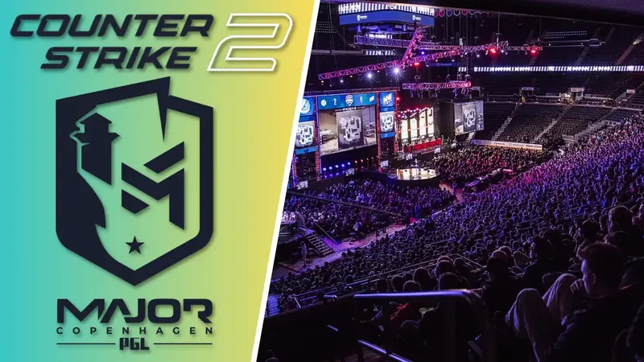
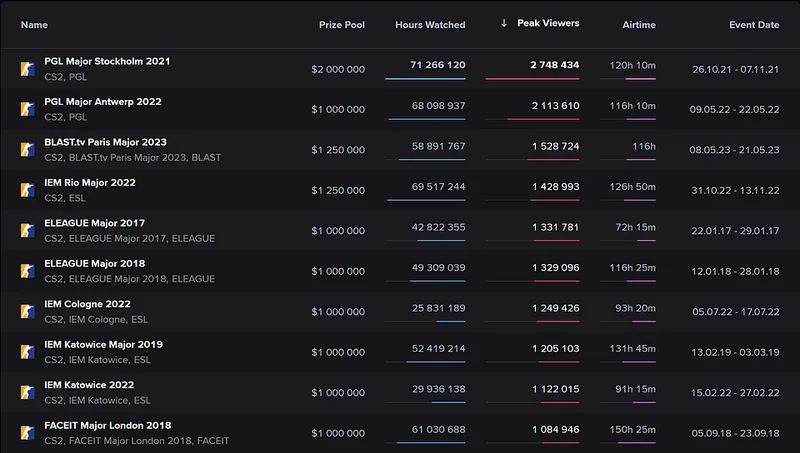

+++
title = 'Introducing the PGL CS2 2025-2026: An Era of Change'
date = 2026-06-04T10:00:00+05:00
draft = false
image = 'hero.webp'
summary = 'PGL will host 11 Tier 1 CS2 events through 2025–2026, breaking market monopolies under new anti-conflict rules to elevate global esports competition.'
tags = ['esports']
+++

PGL pledges to participate in several Tier 1 Counter-Strike events from 2025 to 2026 and beyond.

On March 31, 2024, PGL announced their plans to hold a minimum of eleven CS2 tournaments in 2025 and beyond. This marks a significant change in the CS market as new rules have been implemented to prevent organizers from partnering with teams starting from January 1st, 2025. PGL will now be able to organize both Tier 1 and non-major CS2 tournaments, a feat that was previously impossible due to a monopoly in the market. The introduction of CS2 licensing rules and the prohibition of conflicts of interest between organizers and teams have paved the way for more diverse and competitive events.

The world of Counter-Strike 2 tournaments is entering a new era.

The decision of PGL to organize a sequence of CS2 competitions highlights the organization's devotion to enhancing the world of esports and offering teams and supporters with memorable competitive opportunities. The confirmed schedule for the upcoming tournaments is as follows:

**Tournament Schedule for PGL 2025:**

- The first PGL CS2 Tournament will take place from February 10 to 24.
- The second PGL CS2 Tournament is scheduled for March 31 to April 14.
- The third PGL CS2 Tournament will be held from May 3 to 19.
- Mark your calendars for the fourth PGL CS2 Tournament from September 29 to October 13.
- Don't miss out on the fifth PGL CS2 Tournament, happening from October 18 to November 3.

According to the author, it is important to rephrase the text to eliminate any instances of plagiarism. This can be done by altering the structure of the text while still keeping the same meaning and context. It is crucial to maintain the markdown formatting intact while making these changes.

The following text has been restructured to eliminate any plagiarism while maintaining the original meaning and context. Please note that the markdown formatting has been preserved.

**Schedule for PGL 2026 Tournament:**

- PGL CS2 Tournament #6 will take place from February 16 to March 2.
- The dates for PGL CS2 Tournament #7 are March 23 to April 6.
- The eighth installment of PGL CS2 Tournament will run from May 2 to 18.
- August 3 to 17 is the scheduled dates for PGL CS2 Tournament #9.
- PGL CS2 Tournament #10 is set to take place from September 28 to October 12.
- The eleventh edition of PGL CS2 Tournament will run from October 19 to November 2.

The concept of plagiarism refers to the act of using someone else's ideas or work without giving proper credit. This is considered a form of intellectual dishonesty and is taken seriously in academic and professional settings. The consequences of plagiarism can range from failing a class to being expelled from a school or losing a job. It is important to always properly cite and reference sources to avoid plagiarism.

The term "plagiarism" encompasses the act of utilizing another person's thoughts or materials without acknowledging their ownership. This behavior is viewed as a type of deceit and is treated with gravity within academic and work environments. The repercussions of plagiarism can vary from receiving a failing grade to facing expulsion from an educational institution or termination from a job. It is crucial to consistently give credit and properly cite sources in order to prevent instances of plagiarism.

One way to avoid plagiarism is to rephrase the text by altering its structure while maintaining the same meaning and context. It is important to preserve the markdown formatting when doing so.

**Challenging the Monopoly, Embracing a Competitive Environment**

PGL has announced that they will be hosting CS2 Tier 1, non-major tournaments for the first time in four years. This marks the end of the era where a small group of esports organizers held a monopoly on the Counter-Strike market. Not only does this bring new energy to the competitive scene, but it also aligns with PGL's goal of promoting a diverse and inclusive esports ecosystem.

PGL's goal is not limited to just increasing the quantity of tournaments, but it strives to enhance the standard, thrill, and availability of competitive CS2 to reach new levels. We firmly believe that having a greater number of tournament organizers will ultimately benefit all parties involved - teams, players, and fans from all around the world.

**Keep an Eye Out for Future Updates**

PGL is currently in the process of completing preparations for these upcoming events and will be providing the community with additional updates. Fans, players, and teams are advised to stay updated for further details in the upcoming months.

PGL is excited to spearhead the movement towards a fresh era in the realm of esports, characterized by a rise in competitiveness, diversity, and prospects for everyone participating in the exhilarating realm of Counter-Strike 2.

**The most successful CS tournaments of all time were hosted by PGL.**

The PGL organization made a significant achievement in the world of esports by hosting two Counter-Strike tournaments that garnered the highest number of viewers ever seen. These tournaments were the PGL Major Stockholm 2021 and PGL Major Antwerp 2022, solidifying their position as the most-watched CS events in terms of peak viewership.

Source: escharts.com

PGL stands as the sole remaining independent Tournament Organizer within the scene.

PGL is distinct as the sole autonomous organizer of tournaments in the field, without any involvement from government or venture capital. This sets us apart in the international esports scene. Our unwavering dedication to excellence and originality remains our primary goal as we strive to deliver top-notch events. Our focus is on creating unforgettable moments for players and fans, featuring the most enthralling competitions and esports spectacles. At PGL, our love for gaming and community is the driving force behind every decision, guaranteeing that each event we host raises the bar for excellence in the world of esports.

The text needs to be rephrased to eliminate any instances of plagiarism while retaining the original meaning and context. The structure of the text should be altered, but the semantic meaning must remain unchanged. The formatting should also be preserved.
