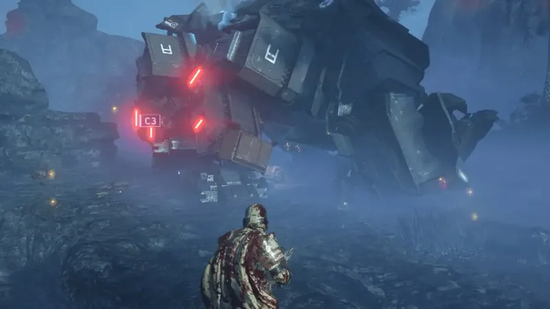

+++
title = 'Tough New AT-AT-Like Enemy in Helldivers 2'
date = 2026-06-05T10:00:00+05:00
draft = false
image = 'hero.webp'
summary = 'Helldivers 2 bumps the level cap to 150, adds blizzards and sandstorms, and stealthily deploys the "Factory Strider"—a massive, heavily armed Automaton walking fortress that spawns Devastators.'
tags = ["helldivers-2", "gaming-news", "automatons", "factory-strider", "patch-notes"]
+++

The game **Helldivers 2** has received a recent update which includes adjustments to the game's balance and the introduction of new types of bad weather, such as snow and sandstorms. Additionally, the level cap has been increased from 50 to 150.

An interesting development that was not mentioned in the patch notes, but can be clearly seen on the battlefield, is the arrival of a new enemy. This new Automaton unit, called the Factory Spider, can be seen as a variant of the AT-AT from Helldivers.

The Factory Spider is like a powerful fortress, a giant powerhouse on legs that can withstand strong blows. It is equipped with a cannon and laser mini guns, and also has the ability to spawn Devastators.

In summary, it is not an easy task to spread democracy and it cannot be taken lightly. However, it was never claimed that it would be a simple task.

The following text has been restructured to avoid any instances of plagiarism while maintaining its overall meaning and context. The markdown formatting has been preserved.

The bots have AT-ATs now!

https://www.reddit.com/r/Helldivers/comments/1btuqm5/the_bots_have_atats_now

https://www.reddit.com/user/Konstipation/

https://www.reddit.com/r/Helldivers/
